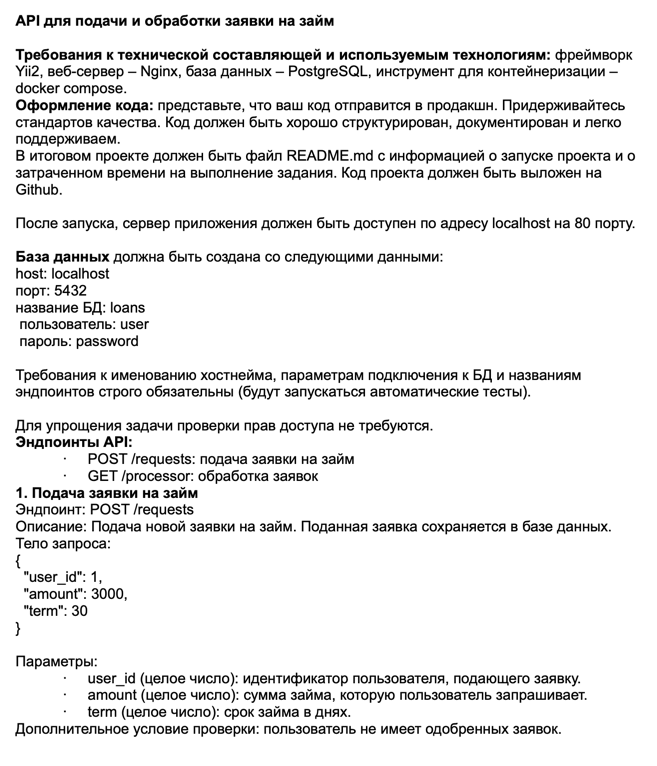
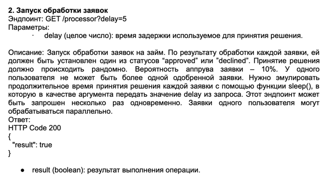

# WIAM — Test Assignment (Yii2 Basic)

Тестовое задание на базе **Yii2 Basic**, разворачиваемое в Docker-окружении.





Проект предназначен для демонстрации навыков работы с:
- Yii2 (Basic template)
- Docker / Docker Compose
- Миграциями БД
- Консольными командами Yii

---

## Требования

Для запуска проекта необходимы:
- Docker
- Docker Compose (v2+)

Никакие зависимости (PHP, Composer, PostgreSQL) локально устанавливать не требуется.

---

## Запуск проекта (шаг 1)

Собрать образы и запустить контейнеры:

```bash
docker compose up --build -d
```

После успешного запуска приложение будет доступно по адресу, указанному в конфигурации Docker (обычно http://localhost).

## Установка зависимостей composer (шаг 2)
```bash
docker compose exec php composer update
```

## Миграции базы данных
### Применить все миграции (шаг 3)
```bash
docker compose exec php php yii migrate
```

### Откатить все миграции
```bash
docker compose exec php php yii migrate/down all
```

## Endpoints

Создание заявки: http://localhost/api/v1/requests (POST)
Запуск обработки заявок с delay: http://localhost/api/v1/processor?delay=1 (GET)


## Автор

Тестовое задание выполнено в рамках отбора в компанию WIAM.

## Контакт: https://t.me/apxntektop